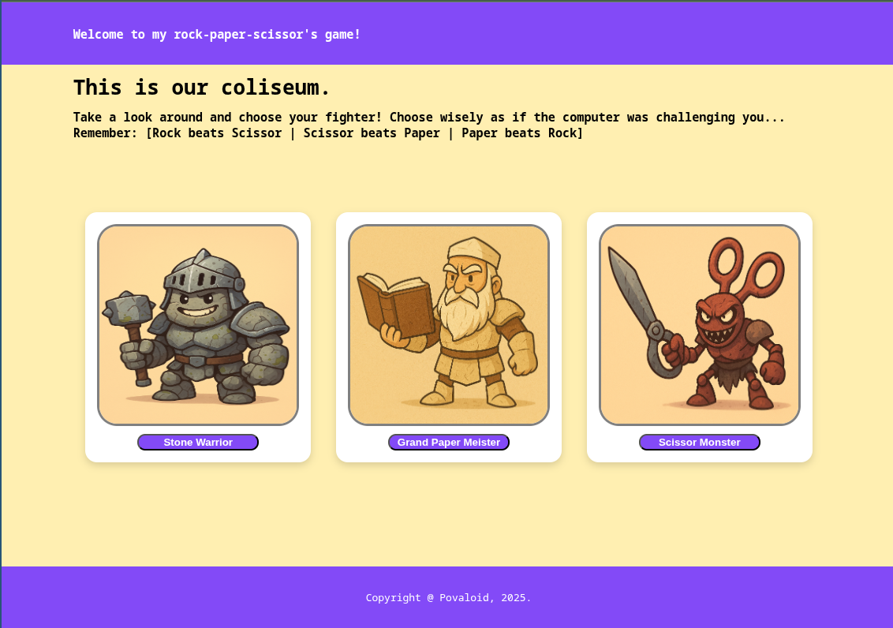

# op-rockpaperscissors

A little **gamified web app** inspired by *The Odin Project's* learning path.  
Instead of a plain rock–paper–scissors game, it’s presented as a **Coliseum battle**, where warriors fight for their lives in epic duels. ⚔️

You can check it out on: https://jorgearcarvalho.github.io/op-rockpaperscissors/

---

## 🚀 Features
- Classic Rock–Paper–Scissors logic
- Coliseum-themed interface and atmosphere
- Beginner-friendly code structure (HTML, CSS, JavaScript)

---

## 🛠️ Tech Stack
- **HTML**  
- **CSS**  
- **JavaScript**

---

## 🎯 Learning Goals
This project was built to practice:
- DOM manipulation
- Event handling  
- Basic game logic in JavaScript  
- Project structuring

---
